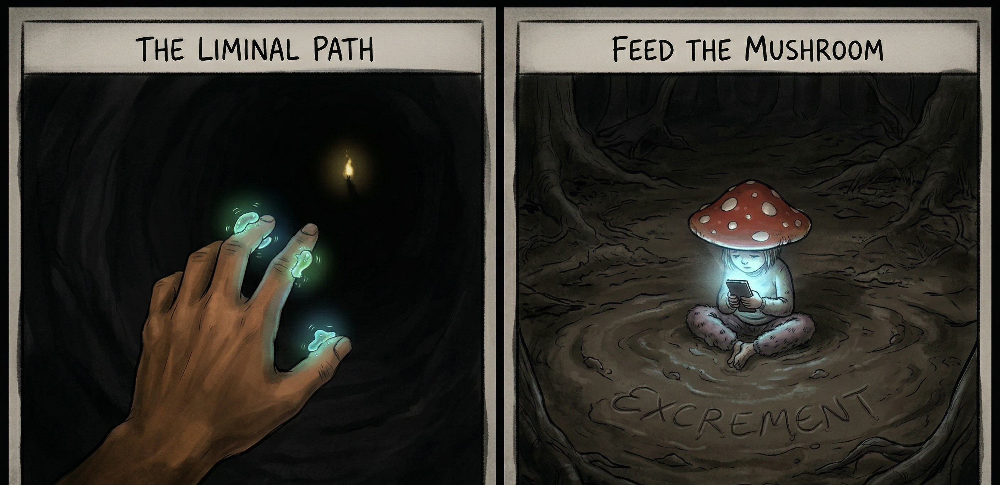
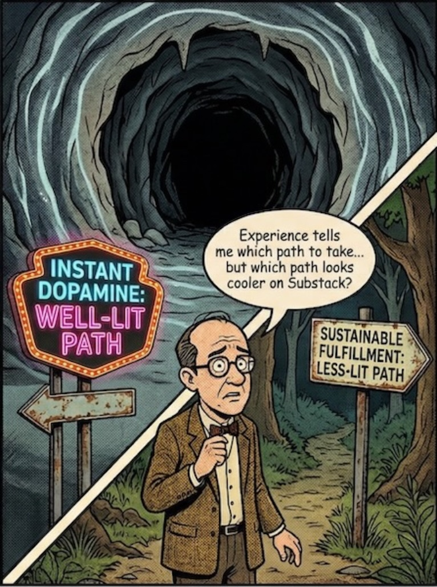

{fig-alt="Liminal path or feed the mushroom." width="100%"}

I have been struggling to find the words for what I am trying to say. I know times are rough; for many, the world looks dark. We feel left behind, crawling through the gloom, feeling for a path we *think* is forward, yet possessing no compass or landmark to guide us. In that darkness, it is easy to succumb to the "doom scroll"—to simply stop and sit down in the shadows.

You don't know how long it will take to find your way out, or if you are even progressing. Some call this the "Dark Night of the Soul." I am not so certain that I enjoy that phrase or find it useful. The "Dark Night of the Soul" does elicit feelings of angst, meaninglessness, isolation and doubt. The not knowing. Finding yourself at the bottom. But there is a hidden mercy in that deep shadow: the smaller the light, the more profoundly it penetrates the contrast. The purification and rebirth that is promised by the "Dark Night of the Soul" is easier to see as light and awareness start to penetrate your darkness.

The other poetic version is being in a liminal space or the in-between space where you are waiting for the new to begin. I have heard that expression as to where I have been lately. Sounds great as going through birthing to be born again, but you are still in that dark space. Bumbling. Trying to find a way. Any hint of the path that gets you out.

Your eyes start picking up the illumination. Brief flickers then longer duration like observing a firefly in the darkness. You feel drawn like a bacterium drawn to an energy source by bumbling to it. This is probably the more optimistic version of the mushroom theory where they feed you excrement and keep you in the dark.

I have been there at times. Feeling trapped. Each time finding a path to move. As I talk through this process that is part of where I am now. Trying to figure things out. Using different metaphors and spiritual sayings to try to describe where I am at. Fumbling with each in part because the vibes resonate with myself and I am assuming you with different thoughts and feelings.

Now. I am not selling tarot interpretation, but there is significance in the message delivered by the card images. For the liminal space, The Fool - leap of faith into the uncharted. The Moon - illusions, dreams and unconscious. The High Priestess - inner wisdom and subconscious. Death - great transformation. Each card is used to describe the liminal space. I have felt or been part of these descriptions a few times over the years.

## Threshold of the Liminal Path

Maybe it is my age showing. Taking stock of my path. The why. The other is that with all of the changes that is going on in the world. The point that I find myself is like my clumsy description of a standing wave. Basically, finding your self at the exit of the path you were on. As the opening looks to enlarge as you are coming out and looking at the new landscape. You eyes getting accustomed to the light. The warmth. The scenes and sounds. All coming to your senses at a dizzying pace. You find a cross road. One path promising more light. The other path not as lit, but more of the sounds and smells that you recognize, that beckon or draw something in your awareness but you cannot name. The other promises the light and potential, but not the same as the less lit path.

Really showing my age here this time, but there was a series on television. I think Tales from the Dark Side where the darker path was more ominous. This is the real problem with the standing wave. You are stuck at this decision point. The lure of the two sirens. One that has been portrayed over the years as bad and one that is lit and the way. The instant dopamine hit versus what could be a forever version of that. Why are we pulled to that instant dopamine hit.

{fig-alt="Standing wave and decision to make." width="100%"}

Is this the experience question really shaping how I am looking at things now? When I was younger, I would jump at that instant dopamine path. Now, a few experiences and my senses are pushing that wait. Haven't you done that before. The lure of the less lit path seems to pull a little or a lot more. I am really hoping that experience is the not the only answer to this predicament. Maybe trying to find more reasons for the less lit path to resonate more.

I could take the rantings path. Things are not like they used to be. The young just are lazy. That is the easy way to look at it. The other is that if we are honest the spectrum is much wider for those affected. We all are on different timing and paths where we may have picked up more baggage and means to survive. The other is the illusion that time is moving faster now. This is the distraction of our attention. The draw of the well lit path and the distractions along the way.

## Your Inner Compass - Detection of Signal

In response to my [competence trap](https://fireinthecave.substack.com/p/the-competence-trap?r=4z5ji "competence trap") article, someone commented that it is hard to follow what makes you happy. I agreed. But now, my take has shifted. I think my life—all our lives—are filled with liminal passages.

Some paths seem to be better lit than others. Are they better lit from your perspective, really?

What does attention distraction actually do?

Dopamine is that magic neurotransmitter that gives the happiness signal your brain detects. The problem is that is a common mechanism for the attention distraction that is occurring in our environments. There are many books on all of these effects. I do not believe that we have to quit everything in this new world to find happiness as others warn.

The problem that many find including myself is that you find out that the lit path did not lead you to where you wanted. Time has past and anxiety grows. What do I do now? You chased down this path. Trying to find what was missing. Do you continue or what is next?

You’ve hit the '[competence trap](https://fireinthecave.substack.com/p/the-competence-trap?r=4z5ji "competence trap")'.

We must "take heart." And that, I think, is the start of escaping the competence trap. We need to trust our basic biological instincts. We need to trust the "chemo-sensing" bacterium inside us that is bumbling toward sustenance, even when we don't understand the chemistry.

Part of the or the whole reason for my starting the Fire in the Cave isn't just to lament. Don't follow what I did. Live just for happiness. That is not the right thing totally either. The first is trusting what may draw you to something in you life. It may be an aspect of what you do. That is the first sense of the happiness marker detecting something that imparts on you.

I started documenting my own journey before the fire in the cave started. Still documenting my own journey. Not suggesting that everyone should, but not saying not to. This exercise wasn't designed or intended to be published at the beginning. I am still a mess and it is not like a traditional biography or autobiography. The writing was not the point to say this is the way. I started journaling and this was the starting point for me. The starting point to see if I can stop picking the well lit path and find the path that sustains me.

## Know Thyself

In the morass and coming to light in this journaling approach are fragments that are annealing to start to show a way or a new picture of myself. In the new path, the stumbles are starting to be recognized. The image that is starting to take shape can be described as know thyself. When the comment about being hard to follow or identify you happiness detector, I think it was due to this simple kernel of know thyself.

{fig-alt="Self-help Cash Grab" width="100%"}

The spiritual ramifications are huge for this. Many self help and other advice pointed at helping you essentially getting to know thyself. People making a ton of money. The estimated global value of the self-help industry was estimated to be \$46 billion in 2025 and projected to be \$90 billion by 2034. In the US alone, it is estimated to be \$12 billion in 2025. Wow. Lot of help needed, do you feel any better? The other angle in the market estimates for self help to consider is how do you know if the spend is doing what you need it to do.

A confounding factor in getting to know thyself is figuring out what are you self limiting beliefs about your reality and what is thrust upon you through others and the environment we find ourselves in. This is a big one and one that I am still navigating.

You will notice that I used ontology stretching interchangeably with know thyself. Ontology is just the words that describe reality as you know it. Stretching is just being open that maybe you are not describing all reality as you know it or more precisely your knowledge of you.

## Traversing to Happiness and Fulfillment

Knowing oneself is an anchor or part of the platform. The other that I have found and still elaborating on is how do I act on it. The moving through the liminal space. How do I navigate? How do I know that I am navigating? How do I know I am heading in the right direction or in generally right direction?

I have started embracing the doer and the observer frame of mind. It is not that I am fully embracing this, but spiritual thinking has a practical side when trying to describe life's walk and/or dance. The observer or the part of you that is taking in the signals. Processing events. Analyzing signals. Identifying and filtering noise from your signal that you want to follow. The observer puts this context in meaning for the doer. A dream. Wants. Desires. The imagination and will to follow. The observer hopefully filters what has meaning from what is noise and projects. Problem is the signals for meaning and happiness must be pretty small compared to the noise signals demanding attention. Otherwise why are there so many unhappy people and anxious people. Media suggesting explosion of young people with mental problems.

For the observer, I bring up and will continue bringing up pattern recognition. We have had pattern recognition since Paleolithic times. Pattern recognition is another continuation of your ontology. You use it to predict or foretell what might happen. The other more important reason to use pattern recognition more and more is engagement of more regions of your brain. There are many reasons that this is helpful that we will cover, but the more brain regions can generate dopamine. More dopamine receptors mean you have a better chance of detecting your happiness marker.

Now, why did I start or title this Looking at the World with Wonder. In general, for me, it was when I was younger or when I was studying and working in the lab. Observing something new to me. Just seeing it. Even today with new astronomy videos from James Webb telescope showing new things about the universe. These insights awaken possibilities in me. A new lens and you can see new things. This is for me. I know that others may not have had this experience or worse. These experiences affect your inner processing. This is true for all.

What I am hoping to do is provide some of the tools, thoughts, symbols and direction that I am looking at. Help with pattern recognition so you can follow your own map to fulfillment. Helping you detect and put together pieces. Maybe even help with obtaining resources from this skill to follow what you want. There are many areas to try to improve and not many people to really help or be honest about what they are going through.
