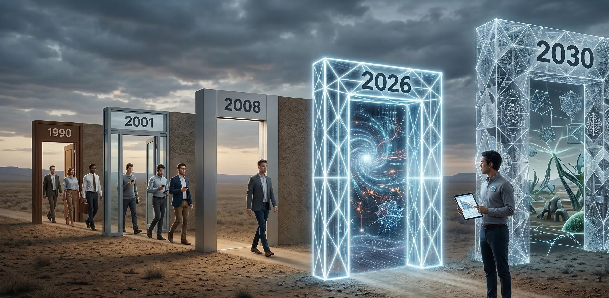
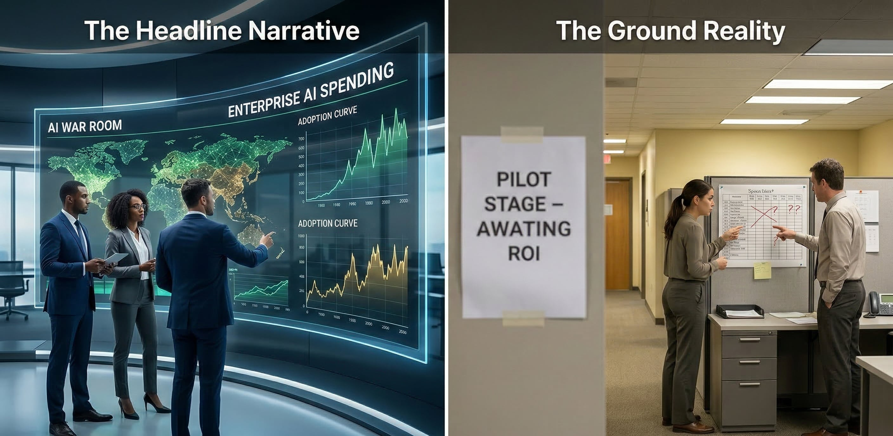
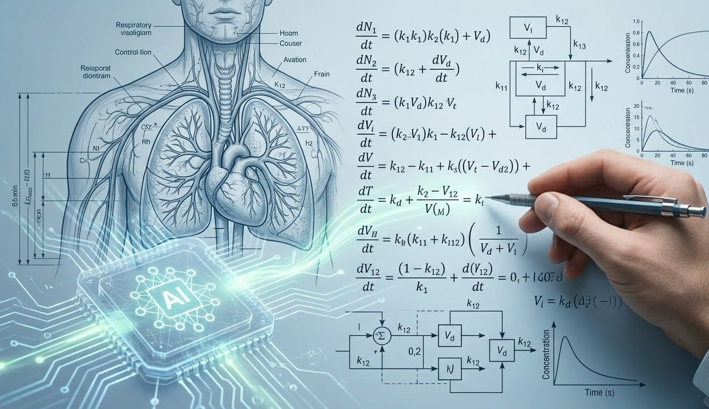

{fig-alt="Reduced rehiring over time." fig-align="center" width="100%"}

The current news highlights more and more layoffs. The Bureau of Labor Statistics (BLS) reported a loss of 92,000 jobs in February 2026. More and more AI is being used as the reason for the reported layoffs. The news and influencers keep pounding the message.

AI is coming for your job.

I have experienced economic cycles at different times in my career. At my first position, I was young and watched the devastation of those forced into early retirement and I was at companies where nearly everyone was let go. I have been on the surviving side and one of those let go.

I have also observed the effects of these cycles on my father and his construction business. I have witnessed from very different angles. Personally being battered by events but with opportunities to pull myself back up. Watching my father navigate the turbulence with what he built on his own.

I want to bring forward something that rarely gets said out loud. Every downturn promises recovery. Every recovery leaves people behind. And each time, the people left behind are the ones who didn't notice the ground shifting under them.

This is the pattern. It started in 1990. Accelerated in 2001. Became undeniable in 2008. And it's about to happen again — where does AI fit in?

## The Pattern

Here's what the data actually shows, and it surprised even me.

Before 1990, recessions were painful but recoverable. You lost your job, the economy bounced back, you got rehired. The unemployment rate started declining within months of the recession ending. Routine jobs — the backbone of the middle class — came back.

Then something broke.

After the 1990 recession, employment took 38 months to recover. After 2001, the jobs lost during the recession never fully recovered before the next recession hit. After 2008, employment continued to decline for nearly two years after the recession officially ended.

The research puts a number on it: 88% of routine job losses since the mid-1980s happened in concentrated bursts during recessions. Not gradually. Not spread over decades. In sharp, sudden windows — and then those jobs never came back.

Each recovery rehired differently. Each recovery assumed a new baseline. After 2001, you needed to be digital. After 2008, you needed to be lean, automated, efficient. The companies didn't rebuild the old org chart. They rebuilt around whatever technology had become infrastructure during the contraction.

Downturns are becoming one-way doors.

## The Gap Between Headlines and Ground

{fig-alt="AI hype vs reality." fig-align="center" width="100%"}

Now let me tell you what the AI landscape actually looks like right now, because the headlines and the ground don't match.

The headlines say 88% of organizations are using AI. Enterprise AI spending hit \$37 billion in 2025. Adoption is exploding.

The ground says something different. Roughly 1% of companies have mature AI deployments delivering real value. Only 20% are seeing actual revenue gains from their AI investments. Most are stuck in pilot mode — clean data, controlled environments, small teams willing to tolerate glitches. The majority of companies haven't figured out how to scale beyond the experiment.

Fewer than 30% of AI leaders say their CEOs are satisfied with the returns. Only one in five companies has mature governance for autonomous AI systems.

What does the Bureau of Labor Statistics (BLS) data look like? If AI is taking jobs and entry jobs, you would expect U-6 (unemployed, marginally attached and part-time workers for economic reasons) rates to increase due to grads taking part time jobs. The labor force participation rate (LFPR) to stay stable or rise as young workers continue to look for white-collar entry jobs. LFPR counts employed and unemployed actively seeking work.

What did the latest BLS report show for February 2026?

LFPR edged down to 62.0% from 62.1% in January 2026. The February LFPR was also lower than the 2025 average range of 62.4–62.7%. Where are the AI jobs?

U6 decreased to 7.9% in February 2026 from 8.1% in January 2026. Falling LFPR and falling U6. Where are the AI jobs?

Others would argue that this is evidence of AI taking jobs. Problem is that this is a common marker observed in the downturns of the 1990s, 2008 and 2020. One would expect solid economic numbers for those companies developing AI.

Recent rumors and data from the AI hyperscalers are painting a different picture. - Microsoft: Thousands of job cuts in Azure/AI orgs (2025) - Amazon: Thousands of job cuts in AWS + e-comm (2025) - Google: Platforms/Devices buyouts and job cuts (Feb 2025) - Meta: \~5% global cut (\~3,600–4,000 roles) (Jan/Feb 2025), \~ 600 job cuts AI/Superintelligence Labs unit (IR, product dev) (Oct 2025)

Recently, Meta is rumored to be cutting 20% of their workforce (\~15,000–16,000 roles from \~79,000 headcount).

AI hyperscalers reducing headcount in a hot AI market.

Meanwhile, the broader economy is running at two speeds. White-collar work (middle management, standard reporting) is the specific layer being hollowed out while the "top" (AI architects/investors) accelerates. At the bottom, consumers are financially exhausted. Tariffs are adding inflationary pressure. Real consumer spending is slowing. Unemployment is ticking up.

I am a modeler. I look at trajectories and observed data for a living. In PK modeling, if you get the direction right but the magnitude wrong, the patient either gets no benefit or a toxic dose. The economy is currently in that 'lag time' where the dose has been administered (AI investment), but the systemic toxicity (job displacement) hasn't fully peaked yet.

The projected AI adoption curve and the actual ground-level reality don't match. I am used to this. In pharmacokinetic modeling, we call it being directionally correct — the trend is right, but the timing and magnitude are what matter.

The trend is right. AI will transform work. But the timing? Most companies are not there yet. The magnitude? When it hits, it will hit through the mechanism that has driven every workforce transformation since 1990, but increasing the time for hiring and reducing the number of employees needed in the workforce.

The downturn.

## What Really Happens Next

Here is where the pattern and the technology collide.

Companies that are currently fumbling with AI pilots — spending \$1.9 million on average with unsatisfying returns — will face cost pressure during the next contraction. Budgets will tighten. Headcount will shrink. And the companies that survive will be forced to actually implement the AI workflows they've been experimenting with, because they'll have no choice.

This is what happened with digitization in the 1990s. With the internet after 2001. With automation after 2008. The downturn is always the forcing function that compresses the adoption curve.

And when these companies rehire — and they will eventually rehire — they will rehire around AI-augmented workflows as the assumed baseline. The same way post-2001 companies didn't rehire pre-internet roles. The same way post-2008 companies didn't rebuild the departments they had automated under pressure.

The jobs that disappear during the contraction won't come back in their old form. New roles will emerge. But they'll be roles that assume you can work with AI, not roles that assume you can't.

## The Trajectory Doesn't Wait

{fig-alt="Domain expertise meets AI fluency." fig-align="center" width="100%"}

Now here is the part that most people are not calibrated for.

Six months ago, the AI conversation was about coding assistants. Helpful. Impressive even. But bounded — a tool that wrote code for you.

A drawing tool for Claude was recently released. I had been authoring a report and needed a figure representing the complex biological model. I described the biology. Claude asked clarifying questions about the biology assumptions. Confirmed the biology mechanism and generated the right figure. I do not want to admit it, but the output was better than what I was putting together.

Claude suggested providing mathematical expressions from the model representation. I thought, why not? The math was generated and correct. That was surprising, but also unsettling. The model was not standard and had to be somewhat derived. This came from three short sentences describing the biology. All parameters that I did not give were included.

OK. I have to admit. I was impressed up to this point. Now for something really useful, I needed a modification and simplification of the mathematical model. This change requires further derivation and is tricky. I typed two words and asked *how does the model change*? Claude updated the model incorporating the changes. All in a format that I can just add to the report.

Claude enabled the setting up of the model. Not to write code about a PK model — to do the actual modeling work. Ordinary differential equations. Compartmental simplifications. System diagrams. The domain reasoning itself. Claude got right that usually takes a human expert significant "pencil-to-paper" time.

This is my professional work. Thirty years of training and experience. AI operated at a level that would have been unthinkable a year ago.

Let me be direct: no one believes this until they test it themselves. I didn't believe it until I tested it. In my first [Substack](https://fireinthecave.substack.com/p/the-recovery-that-doesnt-rehire) piece, I talked about the astrology project — weeks of struggle, then breakthrough. That was the minor upgrade. Six months later, the same class of work took a day. Now the AI is doing collaborative domain-level reasoning with me in real time.

Each jump surprised me. And I was actively testing.

Imagine where people who are not testing think the capability is right now. Their mental model is months or years behind the actual frontier. And the frontier keeps moving.

The trajectory is clear: chatbot to reasoning engine to agentic workflow to autonomous project execution. The benchmarks project that by 2028, AI will handle multi-week projects with minimal human oversight. That's not augmenting a job. That's replacing the concept of certain jobs.

The careers people are training for right now — the five-year degree plan, the professional certification path — the destination may not exist in the same form by the time they arrive. This is not fear-mongering. This is the honest read of where the trajectory goes.

And here is the thing I did not expect: once you work this way, you cannot go back. I am happy building PK models with AI. I hate doing it the old way now. That's not a preference — it's a point of no return. And that personal shift is happening to practitioners one by one, right now, before the companies catch up.

## Navigating AI

So what do you actually do with this?

The stable career of the past was built on repeatable execution. Learn a skill. Practice it for decades. Retire. That model assumed the world held still long enough for the bet to pay off.

The stable career of the future is built on something different. The ability to think, synthesize, and direct. Domain expertise doesn't die — it becomes the foundation that makes AI fluency powerful. My thirty years of pharmacokinetic modeling is exactly what allows me to steer the AI, catch its errors, and know when the output is signal versus noise. Without that expertise, the same tools produce impressive-looking nonsense.

But expertise alone isn't enough anymore either. You need the fluency. You need the working relationship with the tools. You need to have crossed the point of no return yourself — to know what it feels like when the AI is thinking alongside you rather than just responding to you.

Specific skills become obsolete. Specific tools get replaced. But the ability to navigate complex systems, synthesize distributed signals, and create with whatever tools exist — that compounds.

The window to build this is now. During the messy middle. While companies are still fumbling with pilots and the downturn hasn't yet forced the compression. Every previous cycle, the people who prepared during the window came out ahead. The people who waited had to compete for jobs that no longer existed.

## The Choice

In my first piece, I said everyone is making a choice right now whether they know it or not. Wait and see is also a choice.

The pattern says the next recovery won't wait for you to catch up. The trajectory says the capability is moving faster than anyone outside of active testing believes. The economics say the forcing function is building.

I am not writing this to scare anyone. I am writing this because I have seen the pattern before, I have tested the tools myself, and I know what's coming.

The preparation isn't about learning a specific tool. It's about becoming someone who can navigate whatever comes next. That's domain expertise plus AI fluency plus the judgment to ask "should we" — not just "can we."

In the next piece, I'll go deeper into how these AI systems actually work — how they think, how their memory is constructed, what it means for how you build and protect your value. Understanding the machine is the first step to working with it rather than being replaced by it.

*The ground is shifting. It has shifted before. Each time, the people who prepared during the window came out stronger. This is your window.*

I’m not waiting for the next BLS report to tell me the world has changed. I’m rebuilding my workflow now. In my next piece, we’ll look under the hood of these reasoning engines. If you're ready to cross the point of no return, subscribe below.

*I'm not waiting. Join me.*
