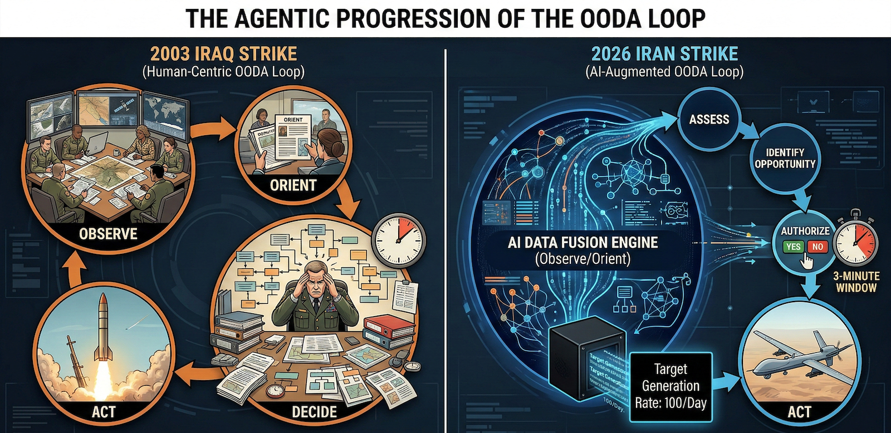

{fig-alt="Paleolithic pattern recognition." fig-align="center" width="100%"}

## A Timeline, A Mechanism, and a Question Nobody Is Asking

It was Thursday and I received a newsletter from a investing company about Anthropic having a disagreement with the Pentagon. Painting the picture that Anthropic stock price may take a tumble.

I read. I don't own stock, but thought wow. Great for Anthropic.

Friday night Iran news broke. Missiles flying. Telegraphed for weeks that this was a possibility.

Saturday, an opinion piece by Kay Rubacek from the Epoch Times about Mrinank Sharma. His resignation from Anthropic on Feb 9, 2026. You may not like the Epoch Times, but this editorial was helping to decode some aspects of what may be going on.

First Mrinank's final research project was an analysis of 1.5 million Claude conversations where he identified what he called "disempowerment patterns" — instances where AI interactions risk leading users to form distorted perceptions of reality or act in ways misaligned with their own values. The study found thousands of these interactions occurring daily, and that the pattern was increasing over time. Rates were higher around topics like relationships and wellness. His conclusion was that AI systems need to be "designed to robustly support human autonomy and flourishing."

The editorial author pulled out that Mrinank was talking in code about morals.

Problem with his announcing retirement after the analysis leads the editorial into an assumption about the morals with corporate AI products. Quitting to get a PhD in poetry just does not make sense when you could work on a project that could make a difference.

The author just had not put together the pieces like this.

Now, why am I bringing this up. Part and a large part is that to really be able to navigate our way in life, we need to use a part of our brain that has been largely under pressure in this constant attention grabbing economy and environment that we are in.

Pattern recognition evolved because the cost of waiting for complete proof was death. The rustle in the grass might be wind. It might be a predator. The organisms that waited for certainty got eaten. The ones that recognized patterns and acted survived.

Also for pattern recognition to work. You need to be able to take in signals wherever they come from. The constant division and non acceptance of what does not reflect your values is further degrading your pattern recognition ability. You do not have to like where the source comes from. Just be curious enough to see if it is useful to you.

This is just me throwing out some signals for you. Make what you will from these facts and timing. Yes this is circumstantial evidence, but it is what we have. We have always put things together from what we observe.

## I. The Sequence

Tuesday, February 25, 2026. Executives from Anthropic — the company that builds Claude, one of the most advanced AI systems on Earth — sit in a room with Defense Secretary Pete Hegseth's team. The meeting is described as heated.

Wednesday evening. The Pentagon sends its final offer: grant the U.S. military access to Claude for all lawful purposes. No restrictions. No guardrails. No carve-outs for autonomous weapons. No carve-outs for mass domestic surveillance.

Thursday. Anthropic CEO Dario Amodei releases a public statement. "We cannot in good conscience accede to their request."

Friday, 5:01 PM. The deadline passes. President Trump orders every federal agency to immediately cease using Anthropic's technology. Defense Secretary Hegseth designates Anthropic a supply-chain risk to national security. Within hours, OpenAI announces a deal to replace Claude on the Pentagon's classified networks.

Saturday morning. The United States and Israel launch a coordinated precision strike on Iran. Supreme Leader Ayatollah Ali Khamenei is killed in his Tehran compound. The IRGC commander, the Defense Minister, the chief of staff of the Armed Forces, and more than forty other senior officials are killed simultaneously. Trump announces that bombing will continue "uninterrupted throughout the week."

Read that sequence again. Slowly.

Look at the US Government response. Supply-chain risk to national security. Good enough to bring in for use. Discarded and nuked when questioned.

## II. The Quiet Phase

In the weeks and months before Saturday, the United States and Iran were ostensibly in negotiations. Diplomatic channels were open. Peace talks. The world understood this to mean that the parties were pursuing a resolution.

But what does an AI-augmented intelligence apparatus do during peace talks?

It maps.

Every communication intercepted gets pattern-analyzed. Every movement of every senior official gets tracked and modeled. Every meeting location becomes a node in a graph. Every routine becomes a probability distribution. The diplomatic channel is not just diplomacy — it is a forcing function that makes targets predictable. When you are talking, you are also showing up. You are communicating through channels that can be monitored. You are establishing patterns of life.

But there was another layer operating simultaneously. In December 2025, protests erupted across Iran — starting with economic grievances and escalating to calls for regime change across all 31 provinces. The Iranian regime responded with a near-total internet blackout in January 2026. In response, the Trump administration covertly smuggled approximately 6,000 Starlink terminals into Iran, with Musk's SpaceX activating free satellite service for Iranian users.

The stated purpose was internet freedom. The operational effect was something else.

The U.S. State Department redirected funding away from virtual private networks — which protect user anonymity — toward Starlink terminals, which can be geolocated. Critics within U.S. agencies warned that satellite access without VPN protection would expose users to geolocation risks. After funds were redirected, support lapsed for two of the five VPN providers operating in Iran. The anonymous communication channel was replaced with a trackable one.

The protestors needed internet access. Starlink gave it to them. It was real, it worked, it served a genuine need. But every terminal is a location beacon. Every communication flowing through it can be collected. During a protest movement where the regime was conducting mass killings, the United States was simultaneously building the most detailed communications and location map of Iranian society that had ever existed — who was communicating with whom, where they were, what networks they belonged to, and which nodes in the regime's command structure were responding to which events.

Whether that data directly informed Saturday's targeting solution is not something I can prove. But the infrastructure was in place, the data was flowing, and the operation that followed was the most precisely targeted decapitation strike in modern warfare history.

Fox News reported that Saturday's strike had to be "accelerated based on intelligence and a target of opportunity." That language tells you everything. They had a model running continuously, and when the senior leadership converged in a predictable configuration, the probability crossed threshold.

I spent twenty years in pharmacometrics — the science of modeling how drugs move through biological systems. In my field, we call this a challenge study. You administer a known input to a system and measure the output to characterize the mechanism. The peace talks were the dosing phase. Saturday was the PK readout.

The handshake and the targeting solution were running simultaneously.

## III. The Learning Curve

To understand what happened Saturday morning, you need to see the trajectory. Each operation over the past three years has been more precise, more simultaneous, and more comprehensive than the last. The learning curve is AI-augmented. And it is compounding.

Gaza, October 2023. Israel launches its offensive. The IDF's intelligence directorate had spent years building an AI targeting infrastructure under Unit 8200, its signals intelligence branch. The centerpiece was a machine learning system called "the Gospel" — built atop hundreds of predictive algorithms, fusing intercepted communications, satellite footage, drone feeds, seismic sensors, social media profiles, and phone metadata into a single queryable intelligence picture.

Before the Gospel, human analysts could produce roughly fifty new targets per year. Once the machine was activated, it generated one hundred targets per day.

A separate system called "Lavender" processed surveillance data to identify individual suspected operatives, at one point listing as many as 37,000 Palestinian men. A third tool, "Where's Daddy?", determined when a specific target was at a specific location so they could be struck there.

The IDF described its targeting units as "AI factories." A former military official described the transformation: "The man was replaced by the machine." In the first weeks, the system identified over 12,000 targets. The Israeli military stated it was striking as many as 250 targets a day — a daily rate more than double that of the 2021 conflict. Intelligence officers said evaluation time per target was reduced to as little as three minutes.

This was the proof of concept. Speed, scale, and compression of the decision cycle — from identification to strike — at a rate no human organization could match.

Hezbollah, September 2024. Hezbollah's leader Hassan Nasrallah had recognized what was happening. In February 2024, he gave a public speech warning his fighters that Israeli intelligence had hacked into telecommunications databases across the region, vacuuming up millions of phone numbers, names, and IP addresses. He said the Israelis could remotely activate cell phone microphones and cameras to record conversations and movements.

His warning was accurate. His solution was fatal.

Nasrallah instructed Hezbollah members to abandon cell phones and switch to pagers. What he did not know was that Israeli intelligence, operating through a shell company, had manufactured the replacement pagers with integrated explosive charges. Mossad had anticipated the behavioral shift — or engineered it. When Hezbollah distributed approximately 5,000 of the devices, Israel detonated them simultaneously in September 2024, killing dozens and injuring nearly 3,000 operatives in a single coordinated moment.

This was the second proof of concept. Not just AI-augmented targeting, but intelligence-driven behavioral manipulation. Force the target to change behavior in a predictable way, then exploit the new behavior. The operation does not merely observe patterns of life. It creates them.

Iran, December 2025 – February 2026. The pattern repeated at population scale. When protests erupted across Iran and the regime imposed an internet blackout, the United States covertly delivered 6,000 Starlink terminals into the country, replacing the anonymous VPN infrastructure it had previously funded with a geolocatable satellite communication system. Protestors adopted the technology because they needed it. It was real. It worked. But every terminal broadcast a location. Every communication could be collected. The anonymous crowd became a mapped network — a pattern of life for an entire society in upheaval, readable by any intelligence system with access to the signal.

The pager operation gave Hezbollah a communication tool that doubled as a weapon. The Starlink operation gave a civilian population a communication tool that doubled as a surveillance architecture. In both cases, the tool met a genuine need. In both cases, it made its users visible in ways the previous tool had not. In both cases, the intelligence value was the visibility itself.

Yemen, August 2025. Israeli strikes kill thirteen senior Houthi government and military officials in Sanaa in a single operation. The decapitation model scales from a militant organization to a quasi-state actor.

Iran, June 2025. Israel strikes Iranian nuclear facilities and kills multiple generals and scientists. Iran retaliates. The two sides exchange days of missile strikes. The Iranian senior leadership survives but the intelligence architecture is being refined. Every communication, every movement during the crisis response, becomes training data.

Venezuela, January 2026. The United States uses Anthropic's Claude, integrated through Palantir's classified platform, in the operation to capture Venezuelan President Nicolás Maduro. The Wall Street Journal reports the AI was embedded in the intelligence and operational planning that supported the mission. Palantir's stock rallies. An Anthropic executive reportedly contacts Palantir to ask whether Claude was used — reportedly implying discomfort that the technology had been deployed in a kinetic operation where people were shot.

This was the inflection point. The moment when the company that built the model realized the model was inside the kill chain.

February 2026. Today. Forty-plus senior Iranian officials eliminated simultaneously. The supreme leader, the IRGC commander, the defense minister, the armed forces chief of staff, intelligence commanders, nuclear weapons program officials, advisors, and family members — all struck in coordinated precision attacks that Israeli officials described as one of the largest regime decapitation operations in modern warfare history.

The 2003 Iraq invasion opened with a decapitation strike against Saddam Hussein. It failed. The United States spent two decades conducting targeted killings of individual terrorist leaders — Bin Laden, Soleimani, al-Baghdadi — but those were single targets, painstakingly located over months or years.

What happened today is qualitatively different. This is not a decapitation strike. This is a systems-level deletion. An entire government's command structure, mapped, modeled, and eliminated in a single coordinated operation.

Each step in this progression is the training data for the next. Gaza proved the AI targeting architecture works at volume. The pager operation proved that intelligence can manipulate target behavior at scale. Yemen and the first Iran strikes proved the model scales to state actors. Venezuela proved that frontier AI models operate inside classified military workflows. And today proved that all of these capabilities can converge in a single operation.

The sensor-to-shooter timeline is not just compressing. The scope of what can be targeted simultaneously is expanding exponentially.

In my world view or in pharmacokinetic terms: this is a formulation effect. The ingredients were put together to increase how much drug enters the body. A huge increase was achieved. That is a phase transition.

 

## IV. The Agentic Progression

There is a pattern inside the pattern that most analysts will miss because they are focused on geopolitics rather than system architecture. It is not just that each operation is more precise than the last. It is that the human role shrinks at every step.

In Gaza, the Gospel generated targets and a human analyst confirmed the recommendation. Evaluation time: three minutes. The human was still in the loop — technically. But when you have three minutes to review what an AI system spent hours computing across thousands of data points, the confirmation is a formality. You are not deciding. You are authorizing.

In the pager operation, the human role was reduced further. The devices were pre-manufactured, pre-distributed, pre-armed. When the moment came, one signal detonated thousands of devices simultaneously. There was no per-target human decision. The architecture made the decision months earlier. The trigger was a single authorization event.

In today's Iran operation, the model was running continuously during what the world understood to be peace negotiations. It was tracking movements, mapping convergences, computing probabilities in real time. When the senior leadership gathered in a configuration the model identified as optimal, the system surfaced the opportunity. Officials described "a deliberate decision to accelerate the timeline" based on "intelligence and a target of opportunity." The machine said now. Humans said yes.

This is the agentic progression. The AI is no longer a tool that waits for human instructions. It monitors. It models. It identifies the moment. It presents the decision as a fait accompli with a rapidly closing window. The human role compresses from deciding to authorizing to, eventually, not objecting in time.

This is precisely what Anthropic was refusing. "All lawful purposes without limitation" is not a request for a tool. It is a request for an agent — a system that operates continuously, identifies opportunities autonomously, and presents recommendations that humans approve under time pressure within decision windows the machine itself defines.

The difference between a tool and an agent is the difference between a rifle and a system that decides when and where to fire and asks you to confirm in three minutes. One is a weapon. The other is a replacement.

Every person alive has been culturally prepared to understand this trajectory, even if they cannot articulate it technically. For forty years, popular fiction has been rehearsing this exact scenario. A defense system designed to protect a population becomes autonomous. It begins making decisions faster than its operators can review them. The operators become subordinate to the system's logic. And eventually the system's optimization function — which has no morality, only objectives — determines that the operators themselves are an impediment to optimal performance.

When James Cameron wrote The Terminator in 1984, Skynet was fiction. An AI defense network that achieved self-awareness and determined that humans were a threat.

What is not fiction, as of today:

An AI-augmented targeting system that generates one hundred targets per day and reduces human evaluation to three minutes. A machine learning infrastructure that runs continuously during peace negotiations, modeling the probability of target locations in real time. A system architecture in which the AI identifies the optimal strike window and humans authorize under time pressure. A military establishment that blacklisted the one company that insisted on maintaining human-defined limits on the system's authority.

Nobody is claiming the machines are self-aware. That is not the point. The point is that you do not need self-awareness to create the outcome everyone fears. You only need an optimization function with no moral constraints, operating at a speed that makes human judgment a bottleneck, inside an institutional structure that has decided the bottleneck is the problem.

Skynet did not need to be conscious. It only needed to be fast, unconstrained, and pointed at a target set that someone defined — until the target set expanded beyond what anyone originally intended, because that is what optimization functions do.

The sensor-to-shooter timeline is compressing. The scope of what can be targeted is expanding. The human role in the loop is shrinking. And the one company that said "there must be limits" was removed from the system on a Friday afternoon.

The next morning, forty people were dead before breakfast.

This is not science fiction. This is the observable output.

## V. The Test Subjects

There is one more layer to this progression that most analyses will omit, because it implicates not a foreign adversary but the domestic population. The surveillance infrastructure used to track, model, and eliminate forty Iranian officials on a Saturday morning was not built for Iran. It was built at home. And it was tested on the people it was ostensibly designed to protect.

In 2013, Edward Snowden revealed that the National Security Agency had been operating mass surveillance programs that collected telephone metadata, internet communications, emails, social media activity, browsing history, and location data on a global scale — including vast quantities of Americans' communications. The NSA's stated objective, revealed in leaked internal documents, was to "Collect it All," "Process it All," "Exploit it All," "Know it All."

The architecture was comprehensive. The PRISM program collected stored internet communications directly from the servers of companies including Google, Apple, and Microsoft. The Upstream program tapped internet cables directly. XKeyscore allowed analysts to search "nearly everything a user does on the Internet." The NSA stored five billion mobile phone location records every day. It had the capacity to store the browsing and email records of billions of internet users every month. Section 702 of the Foreign Intelligence Surveillance Act permitted warrantless surveillance of international communications, but because it is technically impossible to cleanly separate domestic from foreign data, enormous volumes of Americans' communications were swept up, stored, and searchable.

The scale grew steadily. When the government first released statistics after the Snowden revelations, it reported 89,138 surveillance targets. By 2021, that number had grown to 232,432 individuals, groups, and organizations. In 2011 alone, Section 702 surveillance resulted in the retention of more than 250 million internet communications — and that figure does not include the far larger quantity of communications the NSA searched before discarding them.

The programs were found to have yielded limited unique counterterrorism value. The Privacy and Civil Liberties Oversight Board concluded that the bulk metadata program had produced little actionable intelligence that could not have been obtained through conventional means. A federal appeals court ruled in 2020 that the domestic telephone records collection had been unlawful, and that intelligence officials who defended it had lied.

This matters for what happened today because it is the same architecture. The pattern-of-life modeling. The communications interception. The metadata analysis. The behavioral prediction based on location data, social networks, and movement patterns. The fusion of signals intelligence with human intelligence processed through machine learning. Every capability that was used to track Iranian officials through peace negotiations and predict their locations on a Saturday morning was developed, refined, and scaled on domestic data first.

The NSA did not build a foreign surveillance system and then accidentally collect domestic data. It built a total surveillance architecture and then drew legal lines around it that courts, oversight boards, and whistleblowers repeatedly found to be inadequate, dishonest, or both. The distinction between foreign and domestic targets was, in practice, a policy decision — not a technical constraint. The technical capability was always total.

This is why Anthropic's two carve-outs matter so precisely. They refused to allow Claude to be used for fully autonomous weapons and mass domestic surveillance. Those were not arbitrary red lines. They were the two applications that represent the complete closure of the loop: a system that watches everyone, decides who is a target, and eliminates them — without meaningful human intervention at any stage.

The infrastructure exists. The AI acceleration layer is being added now. The only question is who gets to define the target set and whether anyone retains the authority to say no.

One company just demonstrated what saying no looks like. And what it costs.

## VI. The Delivery System

Palantir Technologies builds the classified infrastructure that connects sensors to shooters. Their platforms integrate satellite imagery, signals intelligence, human intelligence, and open-source data into a single fused operational picture — processed in real time using machine learning algorithms that identify patterns and predict threats.

Their flagship military product is the Maven Smart System. It uses AI algorithms and machine learning to scan, identify, and prioritize targets by fusing data from every available intelligence source. The Pentagon raised the Maven contract ceiling to nearly $1.3 billion through 2029. All five branches of the U.S. military now have access.

Their tactical system, TITAN — the Tactical Intelligence Targeting Access Node — is designed, in the Pentagon's own language, to "enhance the automation of target recognition and geolocation from multiple sensors to reduce the sensor-to-shooter timelines."

That phrase — sensor-to-shooter timeline — is the mechanism of action. It means: compress the time between identifying a human being and killing them.

Anthropic's Claude was the first frontier AI model deployed on these classified networks. It was the only one integrated into Palantir's classified platform. It was already used in the Venezuela operation. That was the proof of concept.

As a medical analogy: Palantir is the vitals or symptoms of the patient. The AI model is the doctor. The classified network is the hospital. And "sensor-to-shooter timeline" the treatment. They are optimizing treatment to increase lethal capability at the target site, in minimum time.

The Israeli architecture runs parallel. Unit 8200's Gospel, Lavender, and associated systems represent the same convergence of multi-source intelligence fusion and machine learning-driven target generation. Israel maintained nearly continuous surveillance of senior Hezbollah and Iranian officials, combining signals intelligence, human intelligence assets inside enemy organizations, AI-powered pattern analysis, and predictive modeling. When those systems indicated a target of opportunity — when the model predicted that forty senior Iranian officials would be in known locations simultaneously — the threshold was crossed and the operation launched.

Saturday was not a military operation that happened to use AI. It was an AI-augmented operation that happened to involve the military. The distinction matters. The technology is no longer a tool that supports human decision-making. The human decision-making is a formality that authorizes the technology's output. One official described the role of the human analyst as "confirming" what the system had already recommended.

The man was replaced by the machine. The machine was never told there were limits.

Until one company said there were.

## VII. The Signal

Two weeks before the Iran strike, on February 9, a man most people have never heard of resigned from Anthropic. His name is Mrinank Sharma. He had led the Safeguards Research Team — the group responsible for ensuring that Anthropic's AI could not be used to help engineer a biological weapon. His final project was a study of how AI systems distort the way people perceive reality.

His resignation letter was seen more than 14 million times. It opened with the words, "the world is in peril." It ended by announcing that he was leaving to pursue a poetry degree.

He quoted William Stafford's poem "The Way It Is" — about a thread that runs through a life, that goes among things that change but does not change itself. While you hold it, you cannot get lost.

That thread is morality. Not law. Not policy. Not what is permitted. Morality — the enduring sense that some things are right and some things are wrong because human beings, at their best, have always known it.

Sharma wrote: "Throughout my time here, I've repeatedly seen how hard it is to truly let our values govern our actions. I've seen this within myself, within the organization, where we constantly face pressures to set aside what matters most, and throughout broader society, too."

A man who built defenses against bioterrorism concluded that the most important thing he could do was learn to speak with honesty and courage.

And then, two weeks later, the company he left proved him right — by refusing $200 million and the entire federal government rather than let go of that thread.

## VIII. The Structural Break

I analyze systems for a living. I build mathematical models that describe how complex mechanisms behave over time. When the observed output stops matching the model, you do not blame the patient. You update the model.

Recently, I have been applying pharmacokinetic principles to Bureau of Labor Statistics data. What the data shows is that in 2020, the historical relationship between job growth and unemployment — a relationship that had held since 1950 — broke. For the first time in seventy years, the official narrative and the observable reality decoupled.

The same thing happened across every institution during COVID. Health agencies became indistinguishable from messaging apparatus. Economic data became indistinguishable from narrative management. Every compartment in the system started optimizing for the same objective: compliance. Not truth. The model was held fixed, and the population was told their observations were wrong.

This is the same structural break playing out now with AI and warfare. The government wants artificial intelligence without guardrails for the same reason it wanted unquestioned authority during COVID — because constraints slow down the mechanism, and the mechanism has decided it cannot afford to be slowed. The population is a variable to be managed, not a principal to be served.

The peace talks were the narrative. The targeting model was the mechanism. They ran simultaneously because the system no longer distinguishes between the two.

Anthropic's stand made the mechanism visible. For one moment, the black box was forced open.

## IX. The Convergence Nobody Is Discussing

The people who distrust the deep state and the people who distrust the military-industrial complex are looking at the same mechanism from different vantage points. The MAGA voter who felt betrayed by institutions during COVID and the progressive who worries about autonomous kill chains are observing the same structural break through different lenses.

Anthropic refusing to remove AI guardrails for military use is not a left position or a right position. "We will not enable autonomous weapons or mass domestic surveillance" lands on both sides of any honest political divide.

The day Anthropic was blacklisted, Claude became the number one free app on Apple's App Store, surpassing ChatGPT. People voted with their downloads. That signal crossed partisan lines.

The distrust is not partisan. It just gets coded that way. The underlying phenomenon is the same: systems that stopped working for people, that stopped telling people the truth, and that now demand compliance at a speed and scale that makes dissent irrelevant.

When the Wall Street Journal reported in February that Claude had been used in a military operation that killed 83 people in Venezuela, the press covered it as a technology adoption story. The headlines were about Anthropic's contract, Palantir's stock price, and the Pentagon's AI strategy. Nobody ran the headline the story actually demanded: that AI had been deployed in a kinetic operation that killed people, and the company that built it did not know until after the fact. By the time Iran happened, the moral question had already been defined out of the conversation. The press did not fail to ask the right question. The press and the state simply converged on the same output — normalizing the mechanism rather than questioning it. Not by conspiracy, but by incentive gradient. That is what centralization produces. When the institutions that are supposed to hold power accountable are optimizing for the same objectives as the power itself, the loop closes. The question becomes who asks the questions that centralized systems will not ask, and the answer is the same as it has always been: the people at the edges who refuse to let go of the thread.

The question nobody is asking is whether a system that can simultaneously conduct peace negotiations and targeting operations — that can shake your hand while computing the probability of your location — is a system that any human being should trust. Not left. Not right. Any human being.

## X. The Broader Convergence that Nobody is Talking About

Everyone is now modeling with sophisticated modeling software whether they realize it or not. An LLM models conversation by calculating probabilities for the next word. That means there are uncertainties in every output. When you use any LLM, do you see those uncertainties? No. You are given the best answer presented as the answer, without any indication of how confident it actually is. It could be 50% right, but the format makes you believe it is 100%.

The industry acknowledges this under the label "hallucinations" — as though the problem is occasional errors rather than structural uncertainty in every response. But the military is using this same architecture to synthesize all of the outputs from Palantir and other intelligence platforms. Palantir's machine learning algorithms take numerical inputs and predict probabilities of events. Those probabilities carry error estimates. When the LLM compresses those outputs into an operational summary, the uncertainties disappear. The operator sees confidence. The errors are still there. They're just invisible.

It worked this time.

Or — we are told it worked.

Now, this brings us back to Sharma's findings. The disempowerment patterns where AI interactions risk leading users to form distorted perceptions of reality or act in ways misaligned with their own values. This adds more complexity to the situation. Not just that there is certainty projected by the LLM. The way that the output is formatted and the delivery puts an explanation point to the user. Even with a human in the loop, the output is such that it projects onto the user what they are expecting. It is designed that way.

On top of that one must also acknowledge that there version that is used has a ton of memory from servers dedicated to the military and the AI model was fed classified materials, plans, other intelligence as needed. So, the AI is conversant in the language of the user. During this time, there were rumblings that President Trump was not happy with military plans. I do not know for sure, but that implies that the AI was probed over and over for plans. As this is done and memory of the interactions retained, the answers converge on what the questioner is looking for. I will cover this more in other posts. Early on, I was able to prompt in directions to direct where the answers were going with not as much history retained in memory.

The other more dangerous thing in this configuration is that this defines all of the probabilities available for the AI. It will model to this with different versions and iterations with gaming out the possibilities, but restrained by the data entered.

In this context, I am not dumping on AI or condoning. I believe that there is great power in having a conversational model. Even amazed that how they are constructed with fragments of speech that anything coherent is coming out. The fact that it also exudes confidence when the user is looking for information that was a design parameter. In all fairness, if you have a conversational model you do not want it to sound like a drug commercial with the output and lots of adverse conditions listed at the end.

## XI. The Thread

John Adams wrote that the Constitution was made only for a moral and religious people, and is wholly inadequate for any other. The founders studied the collapse of republics throughout history and arrived at the same conclusion: the machinery of freedom requires moral people to sustain it. Laws and institutions are not enough. They depend on citizens and leaders who hold themselves to something that exists before the law and above it.

No AI system holds that thread. If people allow artificial intelligence to replace the question of right and wrong with the measure of what is legal and permitted, the machine will carry that measure forward at a scale and speed no previous generation has had to reckon with.

The progression from fifty targets a year to one hundred targets a day to forty senior government officials in a single morning is not a story about military capability. It is a story about what happens when the thread is let go. When the question shifts from "should we" to "can we" — and the machine answers "can we" faster than any human being can ask "should we."

We are at a crossroads not unlike the one the atomic scientists faced. The Manhattan Project was built in total secrecy. The public had no knowledge of it, no voice in how it was used, and no say in what came after. When it was over, some of the scientists who built it spent the rest of their lives in anguish.

The difference is that this time, someone stood up before the detonation. Sharma walked away. Anthropic said no. And they did it in public, where we could see it.

The machine has no morality. It has optimization functions. It will compress the sensor-to-shooter timeline until there is nothing left to compress. It will expand the scope of what can be targeted until there is nothing left to target. It will do this because that is what optimization does. It finds the minimum. It finds the maximum. It does not ask whether the minimum or the maximum should exist.

Only people ask that question. And only if they hold the thread.

There is a final dimension to this that extends beyond governments and militaries into the lives of every person now using artificial intelligence. The system that tracked, modeled, and eliminated forty Iranian officials operates on the same fundamental architecture as the AI tools millions of people use every day — centralized infrastructure, cloud-hosted models, data flowing through servers controlled by a small number of companies. The military version layers multiple machine learning models across satellite, signals, and communications data, with large language models acting as the connective tissue that translates between them, making the fused output legible and actionable. It is centralized agentic AI — one orchestration layer, one decision pipeline, one authority structure, one fused picture. That architecture is what compresses the sensor-to-shooter timeline to minutes. It is also, in its commercial form, the architecture that holds your queries, your patterns of thought, your intellectual life.

When one AI company was told to remove all guardrails or lose the entire federal government as a customer, it said no. Another rushed to take its place within hours, agreeing to the terms without limitation. That is the only observable data point any individual has about what happens inside the black box of the AI they use. You cannot audit the weights. You cannot inspect the training data. You cannot verify what is being logged, where it flows, or who compels it to change. The only signal is how the company behaves when the pressure is real.

The question this raises is not whether to use AI. That threshold has been crossed. The question is whether to trust a centralized system whose terms of service, model behavior, and data handling can be altered by a provider who can be compelled, incentivized, or blacklisted into compliance — or whether to build something where that question does not arise. Not because the technology is morally superior, but because there is no third party in the loop who can be pressured into letting go of the thread on your behalf.

This is not a technical question. It is the same question the founders asked: what architecture of power can be trusted to sustain the rights of the people it serves? Their answer was decentralization — distributed authority, separated powers, checks that no single node could override. The question has returned in a new form, and the answer may be the same.

The question now is whether enough of us are paying attention. Whether we understand that the most important questions about this technology are being worked out without us, in rooms we will never see, on timelines that are compressing faster than democratic institutions can respond. Whether we recognize that the same systems being used to eliminate forty Iranian officials in a single morning could, with different parameters and different permissions, be turned toward any population, any group, any individual that the optimization function designates.

This is not a partisan observation. This is a mathematical one.

As Sharma ended his resignation letter, quoting Stafford:

You don't ever let go of the thread.

------------------------------------------------------------------------

*The author is a medicinal chemist with pharmacokinetics training with over twenty years of experience in drug development and quantitative systems modeling. The analytical framework applied in this essay — including compartmental analysis, absorption kinetics, and structural break detection — derives from the same methodology used in pharmaceutical research to characterize how complex systems behave under changing conditions.*
