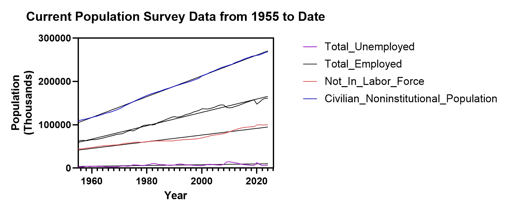
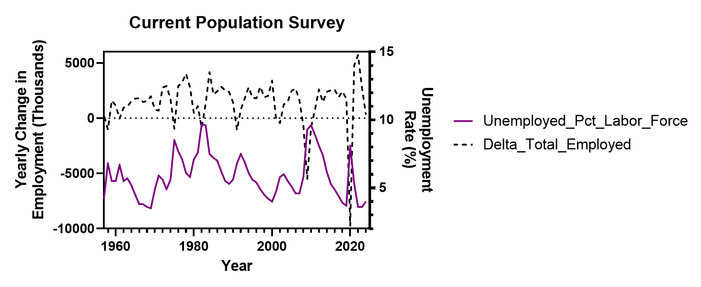
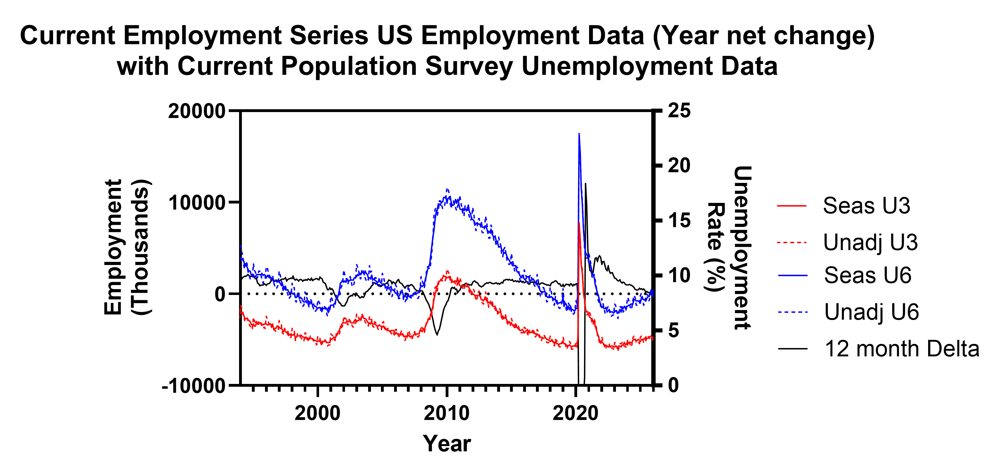
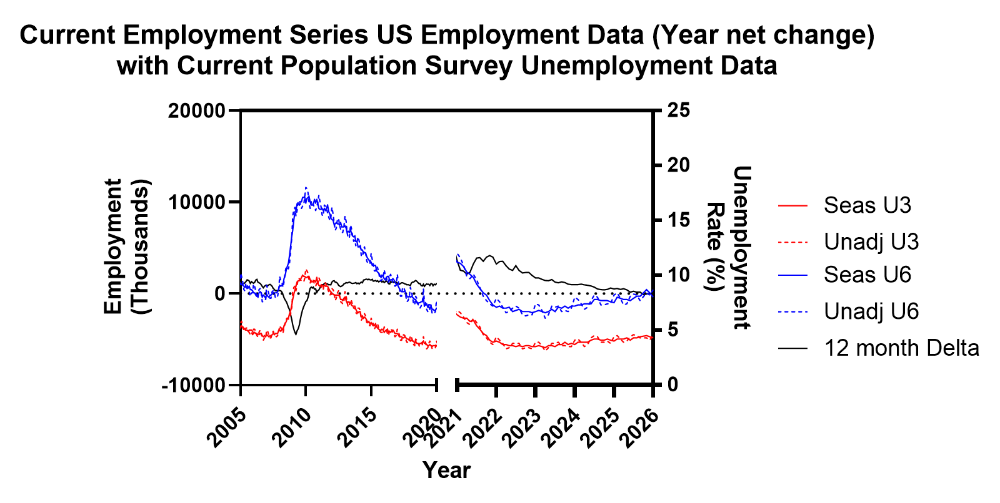
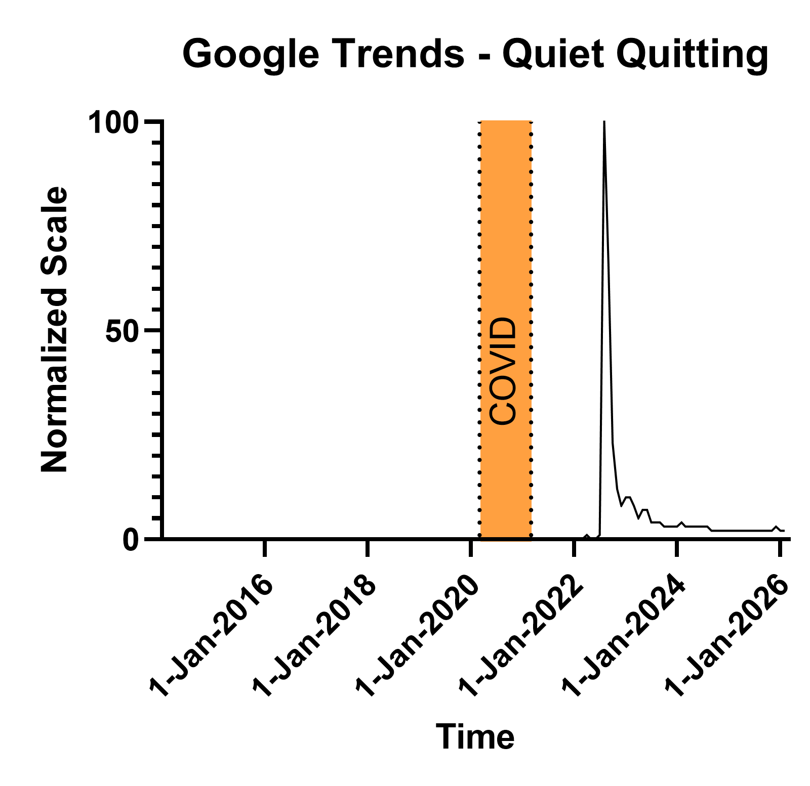
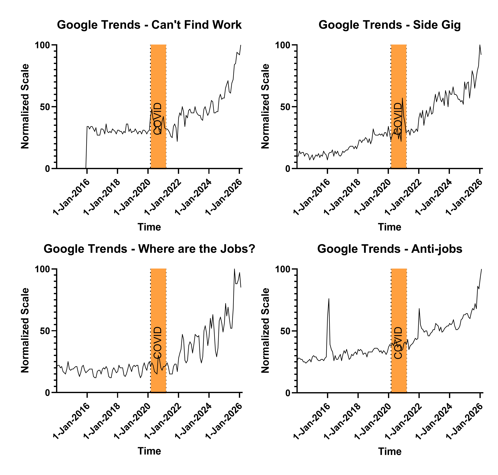

{fig-alt="A solitary figure looking at a fractured city skyline." fig-align="center" width="100%"}

## The Economics

### The Math Has Been Stuck Since the 1990s

From the last post, the Hikikomori, Sampo/N-po, NEET, and Quiet Quitters were introduced and some baseline characteristics.

Why?

The global opt-out cases were first identified with hikikomori. Japan didn't just experience this first — Japan is the blueprint.

In the late 1980s, Japan was running hot. Stock prices up. Land prices up. The salaryman path — school, corporate job, lifetime employment — was more than a career plan. It was identity. Yours and your family's.

Then the bubble collapsed.

By 1992 unemployment was at 2.2%. By 2002 it was 5.4%. That sounds modest until you understand what happened underneath the headline number. Companies protected their existing workers and shut the door on new graduates. An entire cohort came out of school and found the salaryman path had a sign on it: closed. The best they could find were temporary positions, part-time work, or nothing. Japan called it the Employment Ice Age. That's not a metaphor. It lasted from 1993 to 2004.

The other thought one should take away from the previous paragraph is the damage that was done to new graduates with a rather innocuous sounding increase in unemployment. That 3.2 percentage point increase looks almost unremarkable on a chart. It isn't. Aggregate unemployment numbers hide who absorbs the damage. Existing workers kept their jobs. New graduates got nothing. The pain was concentrated entirely on the people with the least leverage — the ones just arriving at the door.

The 2000s didn't fix it. Growth never returned to 1980s levels. The temporary jobs became permanent — not for the workers, but as a category. By the mid-2000s, young workers were "freeters" — non-regular employees earning roughly half the pay of regular workers with few benefits and almost no path forward. Only about 2% of freeters ever made it into full-time regular work. The door wasn't narrow. It was nearly sealed.

This is where the Hikikomori came from. These weren't people who chose withdrawal. They followed the rules, the economy broke the deal, and they broke with it. An estimated 17 million people were caught in this across the stagnation decades — locked into low earnings and insecure work even when conditions nominally improved. The scarring was permanent. It wasn't just the lost opportunity at the door. While they were locked out, the economy kept moving. Skills evolved. Networks formed inside companies they never got to enter. By the time the labor market tightened, they were disqualified on two counts — age bias and a resume that showed exactly where the ice age had found them. New cohorts graduating into the same conditions inherited the same damage. The trap didn't just catch people. It held them.

Then 2008 hit. Exports down. Manufacturing down. Non-regular workers — already the most exposed — absorbed the adjustment through layoffs and contract non-renewals. The lost generation got another layer of loss.

The government's response was to open support centers and expand vocational training. Their answer to a structural economic failure was counseling.

By the 2010s the problem had aged with its victims. Middle-aged Hikikomori still dependent on elderly parents. The 80:50 problem — an 80-year-old supporting a 50-year-old. Japan's economic policy failure made visible in a single household.

The Satori came of age watching all of this. They saw the generation ahead do everything right and get destroyed anyway. So they made a different calculation. Don't invest in a system that already proved it will fail you. Abenomics came and went — headline unemployment fell, corporate profits recovered, real wages stayed flat. Covid cut shifts and incomes. The 2020s brought the highest inflation since the 1990s. Each data point confirmed what they already suspected.

So they adjusted. Not dramatically. Not loudly. They simply stopped wanting the things the system couldn't deliver. The house. The family. The career arc. They live within their means because their means are the only thing the system can't take back.

The Hikikomori couldn't make it work. Their dreams weren't abandoned — they were destroyed over two decades of closed doors, dead-end contracts, and a society that had no place for them. The Satori looked at that wreckage and made a preemptive decision. Don't build what will only be taken. Don't want what will only disappoint.

Same system. One group was broken by it. The other refused to be.

Japan didn't produce two damaged generations by accident. It produced them sequentially, each one inheriting the wreckage of the last with no recovery window in between. The Hikikomori are what happens when the system breaks you. The Satori are what happens when the next generation watches — and then inflation arrives to remove any remaining doubt.

Look across the Sampo/N-po, the NEETs, and the Lying Flat generation and the same film plays in three languages.

South Korea's Sampo/N-po survived the 1997 Asian financial crisis, the 2008 Great Recession, and COVID. Each shock left the same residue — regular employment replaced by contract and non-regular work, wages compressed, inflation eating into every category of the traditional life script. Not just housing. Education. Marriage. Children. Hobbies. Eventually hope itself. That's how Sampo became N-po. Each generation didn't invent new things to give up. The list just kept growing as inflation closed each door behind it.

Europe's NEETs followed the same timeline through the same shocks. Late 1990s downturn, 2008, COVID. Same result — non-regular, low-paying work or no work at all. The difference is Europe put an acronym on it and called it an administrative category. A spreadsheet problem. Which meant the solution was always someone else's budget line.

China's Lying Flat generation inherited the most brutal version of the bargain. Work 996 — nine in the morning to nine at night, six days a week — and maybe you advance. Grind for years and you still can't afford a home. In Shenzhen, housing costs 43 times the median annual income. They did the math on marriage and children the same way South Korea's Sampo generation did and arrived at the same answer.

The formula is consistent across all of them. Economic shocks compound over time. Companies respond by replacing regular employment with contract and non-regular work. Wages compress. Inflation makes the traditional milestones — home, family, security — mathematically unreachable. The cycle runs long enough that entire cohorts fall behind on skills and never catch up. The trap catches people and holds them.

Governments notice late. And when they do act, the response reveals exactly how badly they've misread the problem. Japan opened counseling centers. China banned the phrase "lying flat" and called it unhealthy ideology. South Korea's elders called it whining. Europe made it a funding category. None of them asked why the same output was appearing in five countries with nothing else in common.

The variable was never the culture. It was never the work ethic. It was the deal — and the deal broke everywhere at the same time.

## Quiet Quitting

As I was preparing this article, the Bureau of Labor Statistics released their CES benchmark revision. Employment for 2025 had been overstated by approximately 900,000 jobs. Close to a million. My first instinct was to grab that number and use it as proof — not enough jobs, not enough mobility, quiet quitting validated.

"I’m not looking for conspiracy; I’m looking for the trend."

But the math stopped me. 900,000 against 150 million employed is 0.6%. Within the noise. The revision is real and the error has been trending higher than previous cycles, which is worth noting. But it wasn't the smoking gun I was looking for.

So I kept looking.

The good news is the government provides the data. The bad news is the government provides the data. I used Perplexity to find the right sources and data codes, confirmed what I could independently, and found that the BLS web pages already export the data in workable formats. No modeling assumptions. Their numbers, their calculations — I just plotted what they published.

What the BLS provides isn't just the absolute value. They publish the monthly delta or difference, the 3-month delta, and the 12-month delta. The absolute value tells you the size of the economy. The deltas tell you the health of it. Those are different questions and the answer to the second one is more interesting than the headline number suggests.

### The Data

I pulled population, employed, and not in labor force data from the Current Population Survey going back to 1955. All three increasing over time. Fit a line through each one for visual reference.

Then something jumped out. Employment runs above and below the line. Not in labor force runs the opposite — when employment goes above trend, not in labor force goes below, and vice versa. Perfectly inverse.

That matters because not in labor force isn't just people who retired or dropped out permanently. It contains everyone not actively participating — including discouraged workers, underemployed, people who stopped looking. When that number moves opposite to employment it's telling you something real about the health of the labor market that the headline unemployment rate doesn't capture.

Seventy years of data. Three straight lines. One inverse relationship that holds across the entire period.

That tells you you're looking at the right data. Now look at where the lines break.

The next chart adds the 12-month employment difference against the not in labor force percentage rate. When the 12-month difference is above zero employment is growing. When it goes negative the not in labor force rate moves up. Same inverse relationship, now visible in the rate of change rather than the absolute value.

Then U-3 and U-6. U-3 is the headline unemployment number — actively looking, not finding. U-6 adds the underemployed and the marginally attached. When employment direction changes both move opposite. The seasonal and non-seasonal estimates track closely enough that the signal isn't calendar noise. It's real.

U-6 appears to be rising faster than U-3. That may be a visual artifact. But if it isn't, it's telling you something important.

U-3 rising means people are losing jobs. U-6 rising faster means the deterioration is happening in job quality before it shows up in job quantity. People aren't unemployed. They're underemployed. Stuck in positions below their capacity, below their credential, below what the deal was supposed to deliver.

That's the quiet quitting environment. Not a psychological profile. Not a management failure. A labor market quietly absorbing excess workers into positions that go nowhere — and the people in those positions knowing it.

The signal is indirect. But it may be describing the real conditions more accurately than anything in U-3.

Quiet quitting peaked in 2023 and was back to baseline within a year. The media covered it, debated it, blamed managers, blamed Gen Z, and moved on. The cultural moment passed.

But where are the jobs, can't find work, side gig, anti-work — all still climbing. Accelerating into 2026 with no sign of reversing. These aren't people debating a workplace philosophy. These are people trying to solve a practical problem.

The phrase was the signal flare. What's underneath it is still burning.

The employment data tells the same story from the other direction. Post-COVID the 12-month delta slowing, U-6 separating from U-3 in ways that weren't visible around 2008. Not a crisis spike. Something more like a slow pressure building in a system that keeps being told it's fine.

Is the US already in the same sequence as Japan and South Korea? Maybe not yet. But the Google searches don't care about maybe. People searching can't find work at 2026 levels, while the headline unemployment number stays low, is the same early pattern that showed up in every country before the cultural crystallization had a name.

We may be in the initial stages. Too early to call definitively. But the data is worth watching — and worth taking seriously before it becomes a number large enough for a headline.

## Gen Z

Gen Z grew up in the shadow of 2008. Watching families lose jobs, drain savings, recalibrate everything they thought was stable. That formation experience runs parallel to every other cohort in this series — the Satori watching the Hikikomori, South Korea's youth watching their parents survive the 1997 Asian financial crisis.

The difference is what came after. Unlike Japan or South Korea, the US labor market did recover. The 12-month employment delta turned positive after 2010 and stayed there for most of the decade. U-3 and U-6 came down. By the headline measures the crisis passed.

But the memory didn't.

Then COVID rewrote the rules again. Work from home proved productivity didn't require a commute or an office. Many relocated to cheaper areas, recalibrated their expenses, discovered a different relationship with work. The government allowed emergency 401k withdrawals without penalty — a quiet admission that the economic stress was severe enough to justify raiding retirement savings. Gen Z watched their parents do it.

Then in 2023 a few banks failed. Depositors with accounts far above the FDIC insurance limit were made whole anyway. The very wealthy, the venture capital firms, the well connected. Made whole. Overnight. No penalties. No waiting.

The same government that handed working families a temporary waiver to borrow against their retirement moved without hesitation to protect uninsured deposits that should have carried risk. Then student loan relief — frozen during the crisis, adjusted to, built around — was pulled back. Not gradually. Just ended, while the Google trends for can't find work and side gig were already climbing.

The pattern was consistent enough to be a lesson rather than an anomaly. The floor holds for some people. For everyone else there's a temporary measure, a waived penalty, a frozen payment — and then a return to normal on someone else's timeline.

That's not cynicism. That's pattern recognition.

Remote work looked like freedom. For experienced workers it largely was. For entry level workers it was something else — technically employed but cut off from everything that turns employment into a career. No proximity to people who know things you don't. No visibility to decision makers. No network forming organically around you. The credential bought the job title. It didn't buy the path that used to come with it.

Which is why the Google Trends data is worth taking seriously. The quiet quitting phrase spiked and died — a cultural moment that got named, debated, and moved on from. But where are the jobs, can't find work, side gig, anti-job — all still climbing into 2026. People searching for side gigs at the same rate they're searching for jobs they can't find aren't expressing a workplace philosophy. They're describing a practical problem. The job doesn't pay enough. Or the job isn't there. Or both.

The US isn't Japan in 2002. The conditions aren't as severe and the timeline isn't as long. But the pattern in the search data rhymes with every early stage signal we've seen in the other countries. The cultural moment passed — or did it? The press and government are already impugning character. Lazy. Entitled. Won't show up. The same diagnosis every other country reached before admitting the problem wasn't the people. The underlying condition didn't pass. By the data, it's still worsening.

One more thing worth acknowledging. For every other group in this series — the Hikikomori, the Satori, the Sampo, the NEETs — we are looking backwards. Connecting events that already happened. The causal chain looks clean in retrospect because we know the outcome. The ice age led to the lost generation led to the 80:50 problem. Obvious now. Less obvious while it was happening.

That retrospective clarity probably flatters the timeline. The checkout likely started earlier and under less stress than the documented turning points suggest. People don't wait for the crisis to be officially named before they start adjusting their expectations.

For the US we don't have that retrospective luxury. We are watching it as it develops. Which makes the Google trends more significant not less — they are the real time signal, not the confirmation. And the threshold for checkout may be lower than it was in Japan or South Korea. Gen Z doesn't need to live through fifteen years of deteriorating conditions to do the math. They have the case studies. They watched what happened everywhere else. They know how this movie ends.

The question isn't whether the pattern is real. The question is how far along we actually are — and whether anyone in a position to change the equation is paying attention to the right data.

------------------------------------------------------------------------

*Next: Two forces — one in the classroom, one in the workplace — are already accelerating the timeline.*
